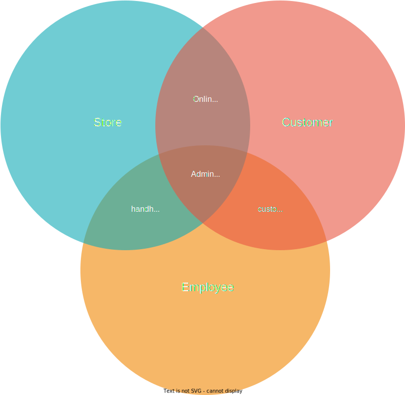
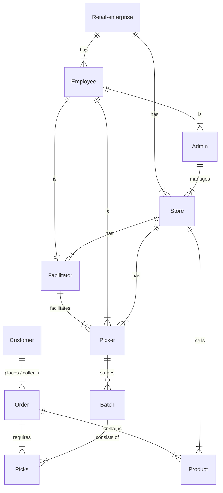

# Introduction

What's common between a person making a sandwich at home versus a gourmet chef preparing Thai curry? They both need fire, salt and a kitchen to cook! 🫕

When working with retail clients, we find that though they all have a distinctive set of experiences that they wish to manifest in the market, there are some ingredients that almost all of them require.

## Anatomy of a retail experience

The diagram provides a high level view of what constitutes in a retail experience.

1. A retail customer places an order to purchase products from a store. For this, the *interface* or the medium of interaction can be an e-commerce / online storefront app, or by physically visiting an outlet, or often even both (buy online, pickup in store).
2. The store employee preps the order, usually with a handheld interface of their own. Depending on the scale of operations of the store, it might be a simple barcode scanner, or a device running software with several sophisticated features to optimize the prep process.
3. Between the customer and employee lies a customer-support / ticket-resolution interface to streamline and resolve customer issues.
4. An admin portal integrates the data from the above 3 flows and lays out their operations for an admin / facilitator.

For a large scale retail, the above components can be quite sophisticated, with each of the above interfaces having their own set of flows. How does that look like?

The following [entity-relationship diagram](https://en.wikipedia.org/wiki/Entity%E2%80%93relationship_model) succintly captures all inter-related things of interest in an **order-fulfillment** scenario - a use-case of several of our large-scale retail clients:

### ER diagram

1. Every large-scale retailer consists of at-least one (or many) *stores* and *employees*.
2. An *employee* can be a
   - *administrator*: Someone who oversees the operations of one or many stores
   - *picker*: (also called *Picker Packer*), is a store / warehouse personnel entrusted with the activity of picking / packing / staging of customer orders.
   - *facilitator*: To facilitate and assist store employees.
3. A *customer* places an *order*, and selects a time-slot for their order to be delivered or picked up.
4. A *pick* is the process of retrieving an item (or its substitute) from inventory or storage. Similar items from multiple orders may be clubbed together into *batches* to ensure a speedier and efficient picking process.
